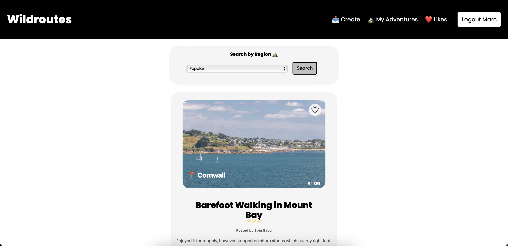

# Wildroutes
A fullstack web app that allows users to explore new adventures.
Live deploy [here](https://wildroutes.onrender.com)

## How to run
1. Download or clone the repo.
2. Open a new terminal window in the main folder and: cd backend -> npm install -> npm run dev
3. Open a new terminal window in the main folder and: cd frontend -> npm install -> npm start

## Screenshots

